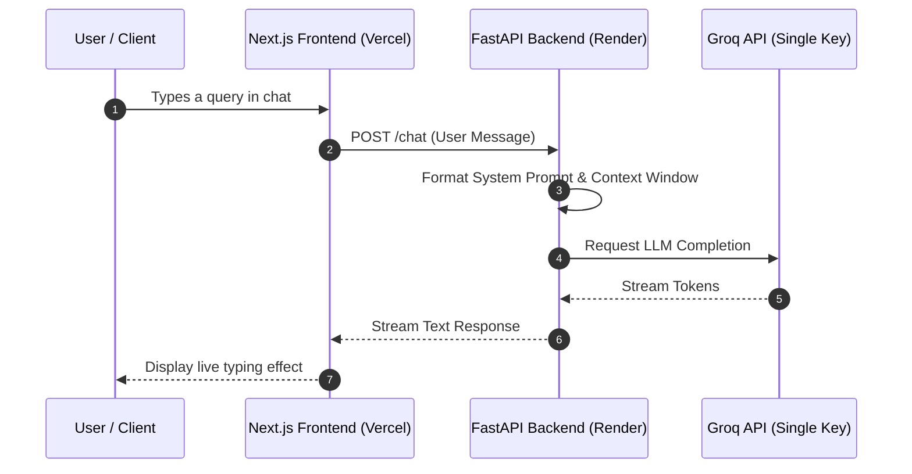

# HelloVR.ai 🚀

    

**An Interactive AI Assistant & Personal Portfolio**

An advanced, decoupled AI recruiter portfolio application. This monorepo project leverages a Next.js App Router frontend deployed on Vercel and a robust FastAPI backend hosted on Render, all powered by a Groq LLM engine to deliver lightning-fast, context-aware responses.

## 🏗️ Architecture

The system uses a decoupled monorepo structure where the frontend and backend operate independently but communicate in real-time using server-sent events (streaming). 



## ⚙️ Deep Dive: Backend Mechanics

The backend is built with Python 3.11 and FastAPI, designed to handle AI chat generation efficiently:

* **Groq API Integration:** The application utilizes a Groq API key for high-speed inference, bypassing the traditional latency overhead associated with standard LLMs.
* **Sliding Window Context:** The system intelligently retains the most recent conversation turns. This prevents the LLM from losing context during longer chats while ensuring the payload never exceeds token limits.
* **Live Token Streaming:** Rather than waiting for the entire response to generate, the backend utilizes asynchronous generators to stream chunks of text back to the Next.js frontend in real-time.
* **Strict System Prompting:** The AI is grounded using advanced prompt engineering techniques to answer questions based exclusively on the injected CV data without hallucinating capabilities, external links, or false roles.

## 🚀 Getting Started

### 1. Clone the Repository

```bash
git clone [https://github.com/vivekrajraghav/HelloVR.ai.git](https://github.com/vivekrajraghav/HelloVR.ai.git)
cd HelloVR.ai

```

### 2. Backend Setup (FastAPI)

```bash
cd backend
python -m venv venv
source venv/bin/activate  # On Windows use `venv\Scripts\activate`
pip install -r requirements.txt

```

Create a `.env` file in the `backend` folder and add your single API key:

```env
GROQ_API_KEY=your_api_key_here

```

Run the server locally:

```bash
uvicorn main:app --reload

```

### 3. Frontend Setup (Next.js)

```bash
cd ../frontend/recruit-bot
npm install

```

Create a `.env.local` file in the `frontend/recruit-bot` folder to link your local backend:

```env
NEXT_PUBLIC_API_URL=http://localhost:8000

```

Run the development server:

```bash
npm run dev

```

## 🌐 Deployment Pipeline

* **Frontend (Vercel):** The Next.js app (`frontend/recruit-bot`) is deployed automatically via Vercel.
* **Backend (Render):** The FastAPI server is hosted on Render.
* **CV Updates:** To update the AI's knowledge base, edit the source CV text inside the backend code and push the changes to the `main` branch on GitHub. Render will automatically detect the commit, trigger a fresh server build, and instantly update the live AI portfolio.
